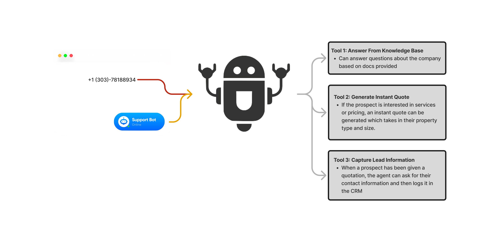
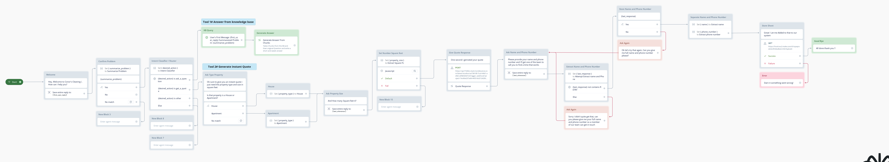
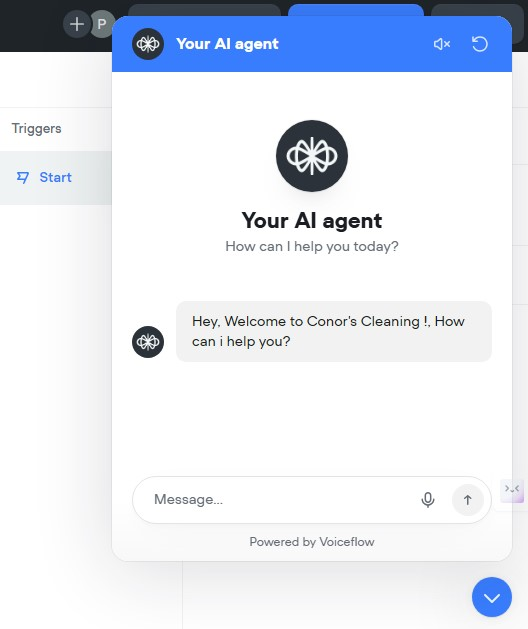

# 🧹 Conor's Cleaning AI Customer Support & Phone Agent

This project hosts a **Voiceflow-based AI agent** built for **Conor's Cleaning**, enabling instant customer support, real-time quotes, and automatic lead generation — deployable on both **Web** and **Phone** channels.

---

## 🎯 Purpose

- Instantly answer customer inquiries.
- Generate instant price quotes based on property type and size.
- Collect lead information (name, phone number) for follow-up sales outreach.

---

## 💸 Business Value

- Increase customer conversion by providing **instant information**.
- Reduce costs by automating basic customer support and quoting processes.
- Capture and organize **high-intent customer leads** effortlessly.

---

## 🛠 Features

- 📚 **Knowledge Base Q&A** from company documents.
- 🧾 **Real-Time Instant Quote** based on customer property details.
- 📇 **Lead Information Capture** and CRM integration ready.
- 📈 **Voiceflow-Driven Dialog Management** for both website chatbot and phone IVR systems.

---

## 🧩 Project Components

| Folder          | Description                        |
|-----------------|------------------------------------|
| `assets/`        | Workflow and visual flow images   |
| `prompts/`       | AI prompts used in Voiceflow       |
| `knowledge_base/`| Conor's Cleaning KB Document (PDF) |
| `voiceflow_project/` | (Optional: Voiceflow project files) |

---

## 📋 Prompts Used

- **Summarize Problem Prompt:** Empathetic problem summarization.
- **Intent Classifier Prompt:** Classify customer intent (ask_a_question, get_a_quote, other).
- **Generate Answer Prompt:** Concise, voice-optimized responses.
- **Property Size Prompt:** Extract square footage as number.
- **Quote Response Prompt:** Single-paragraph explanation of quote packages.
- **Extract Name and Phone Prompt:** Confirm valid customer details.
- **Separate Name and Phone Prompts:** Store separately for CRM systems.

---

## 🎬 Workflow Overview

1. **User initiates conversation** via Web or Phone.
2. **Problem is summarized** and confirmed.
3. **Intent is classified** → routed to KB answer or Instant Quote.
4. **For quotes**, property type and size are gathered.
5. **Quote is generated** and explained in a voice-friendly format.
6. **Lead details are captured** for CRM.
7. **Conversation is closed** after data capture.

---

## 🚀 Deployment Steps

1. **Import** the Voiceflow project into [Voiceflow](https://www.voiceflow.com/).
2. **Customize** API endpoints for:
   - CRM integration
   - Instant Quote generation
3. **Connect** to web chat widget and/or Twilio phone number.
4. **Test** the full flow.
5. **Go Live** 🚀

---

## ⚙️ Technologies Used

- **Voiceflow** (No-code conversational AI platform)
- **Custom APIs** (for Instant Quotes & CRM updates)
- **PDF Knowledge Base** integration
- **Web + Phone deployment**

---

## 📞 Contact

For setup support or customizations, contact:

- **Conor's Cleaning**
- 📍 247 Beacon Street, Boston, MA 02116
- 📧 info@conorscleaning.com
- 📞 (617) 555-0123

---

## 🧹 About Conor's Cleaning

Serving the Greater Boston area since 2018, Conor’s Cleaning offers premium residential and commercial cleaning services with eco-friendly products, certified professionals, and a 100% satisfaction guarantee.

[View Full Knowledge Base](knowledge_base/Conors_Cleaning_Knowledge_Base.pdf)

---
